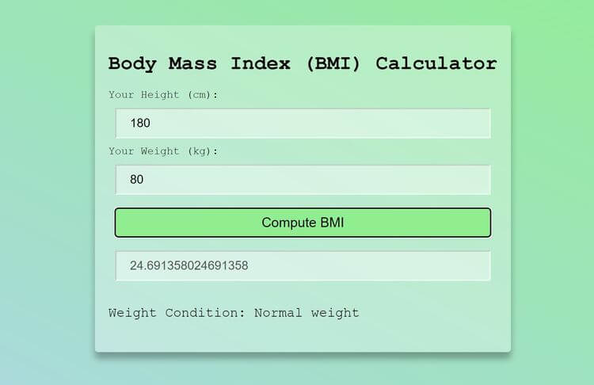

# Calculador BMI

[Demo](https://demo.100jsprojects.com/bmi-calculator)

Queremos implementar una app que calcule el ídnice de masa corporal (IMC). Aunque ya sabemos que por si solo este índice [no es un valor significativo y determinante](https://www.youtube.com/watch?v=5mo-McvEHR0)

1. Introduce la altura en cm
2. Introduce el peso en kg
3. Al hacer clic en _Compute BMI_ debe aparecer el IMC
4. BONUS: Redondea a dos decimales el IMC

## Créditos

Este ejercicio pertenece a la colección [100 JS Projects](https://www.100jsprojects.com/)